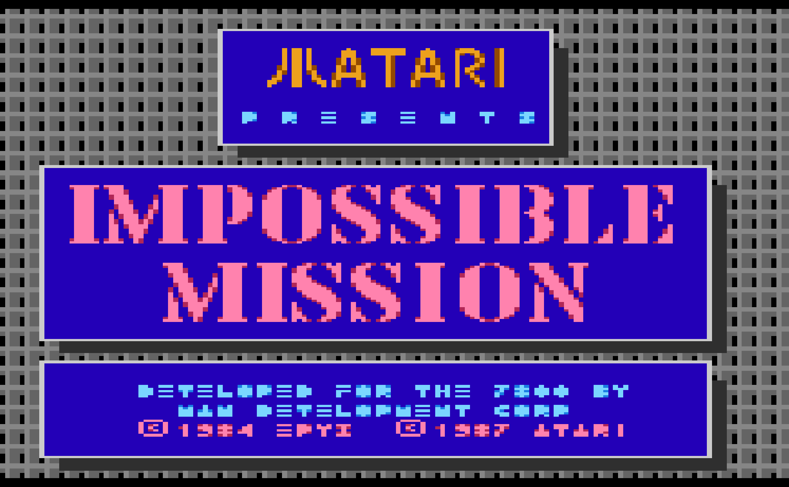

# Atari 7800 Impossible Mission - Walkthrough Guide

**DISCLAIMER:** *All screenshots, etc... are the property of Atari.  Copyright (c) 1989, Atari Corporation.  All rights reserved.*

## Front Page

 * Surviving and searching each of the [Rooms](html/all_rooms.md)
 * Solving [Puzzles](html/puzzles.md)
 * Fun [Tidbits](html/TIDBITS.md)

## Useful Links (external)

 * Atari 7800 Impossible Mission [Instruction Manual](https://www.thegameisafootarcade.com/wp-content/uploads/2017/02/Impossible-Mission-Game-Manual.pdf)
 * The [Commodore 64 Impossible Mission](https://www.c64-wiki.com/wiki/Impossible_Mission) Page
 * Puzzle Pieces: https://www.reddit.com/r/c64/comments/122baww/impossible_mission_a_study_of_the_map_and_objects/
 * Notes from the author? (TBD)
 * [Notes from Video 61 about the "bug"](https://forums.atari.io/blogs/entry/546-raiders-of-the-lost-eproms-update/)
 * Notes about the history of Possible Mission ROMs (TBD)

## Other stuff I'm tracking

 * Notes on randomness
 * All Puzzle pieces and how they go together.  Are there only 36 pieces?  Are there more, selected from a random pool?
 * Are puzzle pieces really placed randomly in each room?  Or, are the locations always the same, but the layout of the rooms is different?
 * Tips for the hardest jumps and most difficult furniture to access in the game.  "Must Haves" for Snoozes.  Top 10 list of difficulty.
 * "What is each piece of furniture"?
 * "Fun" things you can do, like pushing the ball droid down off the bottom of the screen.  You can also pop the orbs on the robots! (they come back if you leave the room)
 * I'm curious if the code screens eventually fill up to 20 tiles, and what happens if you get to 21.
 * Are the "random" map layouts really random, or are there say, a fixed 8 or 32 configurations?
 * I found a bug where if you get more than 9 Lift Inits, the number is recorded as ":".  I'm curious if the same happens for Snoozes and if the graphics change at 10, 11, 12, etc...
 * On the Game End screen, do "Passwords found" mean Passwords found only in furniture?  Or, also from the Code Room Games?  Does this number decrease if you use Passwords in the game?
 * Do difficulty switches make it so that you can't walk past Snooze'd robots?  Manual has no notes on Difficulty switch effect if any.
 * Are the elevator colors all the same on reset?

Guide
 * How many pieces of furntiture total?
 --- ./img/room_screens/blue_room_1.png - 7
 --- ./img/room_screens/blue_room_2.png - 4
 --- ./img/room_screens/blue_room_3.png - 2
 --- ./img/room_screens/blue_room_4.png - 4
 --- ./img/room_screens/blue_room_5.png - 5
 --- ./img/room_screens/blue_room_6.png - 3
 --- ./img/room_screens/blue_room_7.png - 9
 --- ./img/room_screens/blue_room_8.png - 5
 --- ./img/room_screens/blue_room_9.png - 4
 --- ./img/room_screens/blue_room_a.png - 5
 --- ./img/room_screens/blue_room_b.png - 3
 --- ./img/room_screens/blue_room_c_elvin.png - 2
 - SUBTOTAL: 53
 --- ./img/room_screens/green_room_1.png - 4
 --- ./img/room_screens/green_room_2.png - 6 
 --- ./img/room_screens/green_room_3.png - 6
 --- ./img/room_screens/green_room_4.png - 3
 --- ./img/room_screens/green_room_5.png - 6
 --- ./img/room_screens/green_room_6.png - 5
 --- ./img/room_screens/green_room_7.png - 4
 --- ./img/room_screens/green_room_8.png - 3
 --- ./img/room_screens/green_room_9.png - 3
 --- ./img/room_screens/green_room_a.png - 5
 - SUBTOTAL: 45
 --- ./img/room_screens/yellow_room_1.png - 6
 --- ./img/room_screens/yellow_room_2.png - 5
 --- ./img/room_screens/yellow_room_3.png - 3
 --- ./img/room_screens/yellow_room_4.png - 2
 --- ./img/room_screens/yellow_room_5.png - 2
 --- ./img/room_screens/yellow_room_6.png - 0
 --- ./img/room_screens/yellow_room_7.png - 7
 --- ./img/room_screens/yellow_room_8.png - 3
 - SUBTOTAL: 28
 - TOTAL: 126 pieces of furniture, 36 which have puzzle pieces (in a working game).  2 pieces for every 7 furniture items (expected)

HOW LONG DO SNOOZES WORK FOR?
HOW LONG TO SEARCH EVERY FURNITURE PIECE?

## Interesting things in the Instruction Manual:
 * MIA9366B Pocket Computer
 * 1.2 megaradians / forthnight
 * Longitudinal Velocity: Alpha Class: 2.5*10^-8 c
 * Longitudinal Velocity: Beta Class: 1.2*10^-8 c
 * Longitudinal Velocity: Gamma Class: 5.9*10^-9 c
 * Longitudinal Velocity: Omega Class: 0c

Instructions say:
 * sofa, stereo, candy machine
 * Reset rearranges rooms and robots, and a new set of puzzles is generated.  Each time you play, rearranged and puzzles will be different.
 * Sofa, desk, fireplace
 * NOWHERE DOES IT SHOW WHAT A PUZZLE PIECE LOOKS LIKE.  GET PICS OF ALL TYPES
 * YOU CAN BLOW THROUGH YOUR LIFT INITS AND SNOOZES REPEATEDLY AT THE TERMINAL
 * In the code rooms, does it alternate between snoozes and lift inits?
 * Do colors matter at all for Puzzle pieces?  If not, make them all yellow.
 * How many passwords are there?
 * You can make bad puzzle pieces
 * Upper left puzzle in memory windows is NOT the upper left puzzle in the selection window
 * There are 2 tips in there about crossing gaps and jumping with one foot off a lift.  Interesting tip.
 * The ball is called the "Floating orb"

The Code Rooms are harder than the C64 version.  In those, the X's are color coded and correspond to 2 specific notes:
 * https://www.lemon64.com/forum/viewtopic.php?t=76803
In the 7800 version, all is white.

Question: Is our top number of buttons 14?

