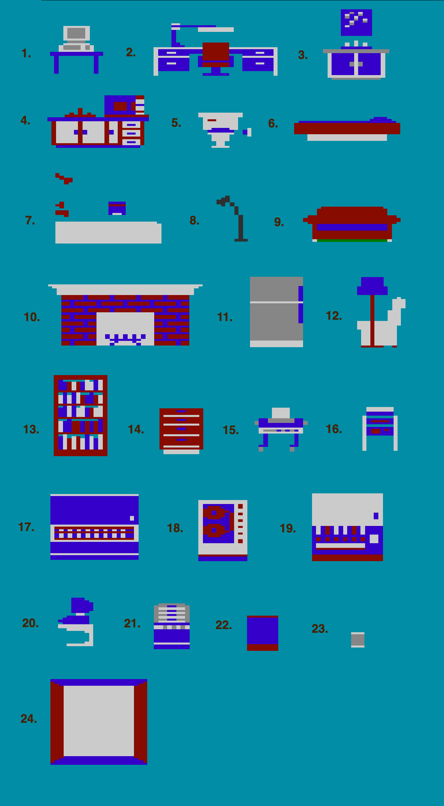

# Atari 7800 Impossible Mission - Walkthrough Guide

**DISCLAIMER:** *All screenshots, etc... are the property of Atari.  Copyright (c) 1989, Atari Corporation.  All rights reserved.*

## Furniture

There are 23 unique pieces of furniture in Impossible Mission.  But, what are they?

Looking at the [Instruction Manual](https://www.thegameisafootarcade.com/wp-content/uploads/2017/02/Impossible-Mission-Game-Manual.pdf), you'll find references to many specific items:
 * sofa, stereo, candy machine (page 7)
 * Sofa, desk, fireplace (page 9)

Here are the individual pieces with a guess as to what they are supposed to be.

------------

