# Atari 7800 Impossible Mission - Walkthrough Guide

**DISCLAIMER:** *All screenshots, etc... are the property of Atari.  Copyright (c) 1989, Atari Corporation.  All rights reserved.*

## Furniture

There are 22 unique pieces of furniture that can be searched in Impossible Mission.  But, what are they?

Looking at the [Instruction Manual](https://www.thegameisafootarcade.com/wp-content/uploads/2017/02/Impossible-Mission-Game-Manual.pdf), you'll find references to many specific items:
 * sofa, stereo, candy machine (page 7)
 * Sofa, desk, fireplace (page 9)

Here are the individual pieces with a guess as to what they are supposed to be.

### Searchable furniture

| Number | Image | Name | Search Time
:-------:|:-----:|:----:|:-------------:
| **1**  | 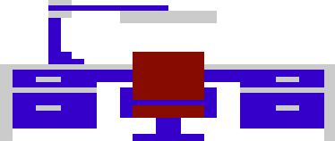 | Desk     | (TBD)
| **2**  | 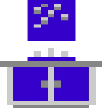 | Bathroom Vanity with Mirror | (TBD)
| **3**  | 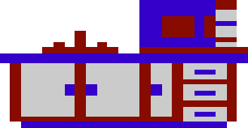 | Kitchen (sink, cabinets, oven/microwave + coffee pot) | (TBD)
| **4**  |  | Toilet | (TBD)
| **5**  |  | Bed | (TBD)
| **6**  | 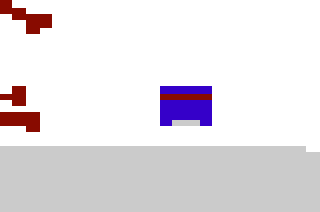 | Bathtub | (TBD)
| **7**  |  | Lamp | (TBD)
| **8**  |  | Sofa / Couch | (TBD)
| **9**  | 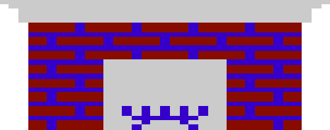 | Fireplace | (TBD)
| **10** |  | Refrigerator | (TBD)
| **11** |  | Chair with Lamp | (TBD)
| **12** | 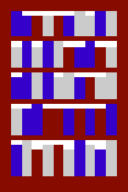 | Bookcase | (TBD)
| **13** | 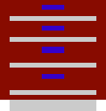 | Chest of Drawers or Tool Chest| (TBD)
| **14** | 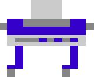 | Plotter? | (TBD)
| **15** | 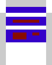 | Sign? | (TBD)
| **16** | 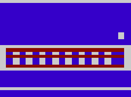 | Cigarette machine? | (TBD)
| **17** | 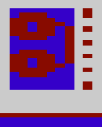 | Data Tape Machine | (TBD)
| **18** | 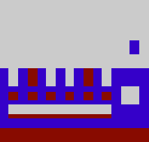 | Candy Machine | (TBD)
| **19** |  | Computer on a desk | (TBD)
| **20** | 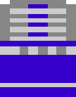 | Jukebox | (TBD)
| **21** |  | Television? | (TBD)
| **22** |  | Garbage Can? | (TBD)

### Other furniture (not searchable)

| Number | Image | Name | 
:-------:|:-----:|:-----:
| **23** | 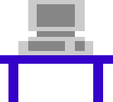 | Terminal
| **24** |  | The Door to Elvin Atombender's secret lair

------------

Next: Solving [Puzzles](./puzzles.md)

------------

[Back to the main page](../README.md)

