# Atari 7800 Impossible Mission - Walkthrough Guide

**DISCLAIMER:** *All screenshots, etc... are the property of Atari.  Copyright (c) 1989, Atari Corporation.  All rights reserved.*

# Solving the hardest rooms

## What are the Hardest rooms?

Let's break this down via a Top Ten List.

------------------

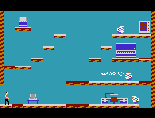
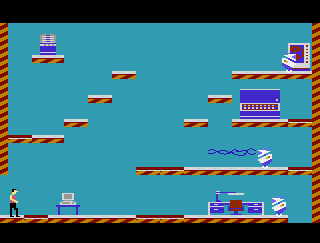

-----------------

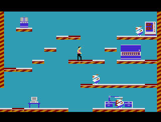

-----------------

## NUMBER THREE: Blue Room 6.

This room isn't too hard; that is, unless you need to search the chair at the top-right of the screen.

This is the only place in the game with holes between the ledges this near to each other.  Can you simply just run across them by holding the joystick to the right?  No, you cannot-- you will fall.  Can you simply perform a series of jumps?  You can-- but it's very risky and more than likely you'll fall.  Many a player has fallen through to the level below, costing them a LIFT INIT or a life if they accidentally touch the robot on the next level.

However, there is a secret.  You have to walk between each level, stop, center yourself, and go again.  See below:

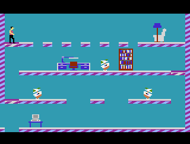

Does the above shuffle-step work?  Yes.  Is it worth it?  Maybe not.  I usually save this room for later; if I am missing puzzle pieces I will enter this room with a few LIFT INITS just in case.  Your pulse may be pounding when walking across the chasm, but take your time.  It can be done!  You just have to know the trick.

-----------------

## NUMBER TWO: Yellow Room 3.

This room may not appear too difficult.  In fact, it's not, with two exceptions.

First, the fireplace can be a bit tricky depending on the robot defending it.  While the jump back to the ledge on the left doesn't require pixel-perfect accuracy, a robot surprising you with a burst of speed could cause you to miscalculate and miss the jump, costing you a LIFT INIT.  You may need a SNOOZES for that particular robot.

However, the real horror is the chest on the floor above.  You may think that you can reach that platform easily by taking the second lift down to its level, but you would be mistaken.  That lift only goes all the way to the bottom from the top, and vice versa.  Since you can't jump off a moving Lift, this won't work:

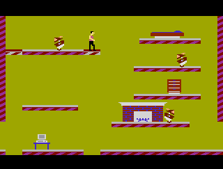

So, how do you get to the chest?  Surprisingly, there are 2 ways.

The first way is most likely to cost you a death via the robot near the fireplace and/or a LIFT INIT.  It may seem impossible, but there is a way to get across to the chest via the ledge on the left:

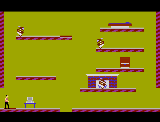

It's important to note that this requires a PIXEL PERFECT JUMP, with the button pressed from a running start while hovering in the air.  Even a jump pressed right on the edge from a running start will lead to an inevitable miss:

The better approach is to jump from the ledge above.  Thankfully, this doesn't require a pixel perfect jump because there are TWO locations where the jump can be performed.  If the robot on the ledge above is too mobile or shoots lasers too frequently, this will likely cost you a SNOOZES to slow him down.  Alternatively, you can "go for it", but you'll probably need to use many LIFT INITS to get the job done if you miss.

Here are the 2 locations you can make the jump from to make it successfully:

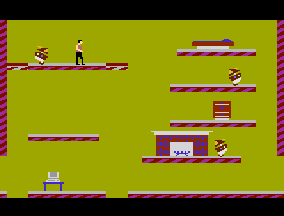

I recommend thinking about it before proceeding; take your time.  Try to place your left foot on the rightmost lip of the third full red diagonal line.  Yes, that's a lot to think about, especially under pressure from robots.  However, you can see that even being one step to the left or one to the right will cause a miss, and you'll have to do it again:

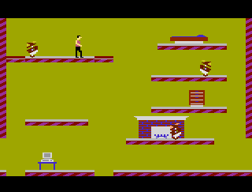
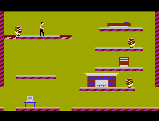

I almost always recommend leaving this chest until all other rooms are cleared.  If you have 36 puzzle pieces, you don't have to bother.  But, if you do have to search this chest, it can be done.  Just follow the above guidance and you'll be fine!

-----------------

## NUMBER ONE: Yellow Room 7.

This room isn't remotely fair for beginners.  Let's start with some basics.

### How to cross the floor

You may not believe it, but it is possible to walk across the chasm that makes up the floor as seen below.  They key is to put yourself in the center of every ledge before proceeding to the next ledge.  If you start too close to the edge, you will fall to your death.  This is a costly mistake if it occurs multiple tines.

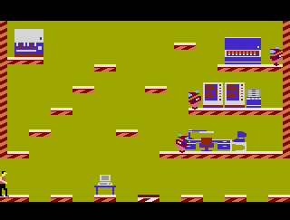

You should know that you can jump across the floor, too:

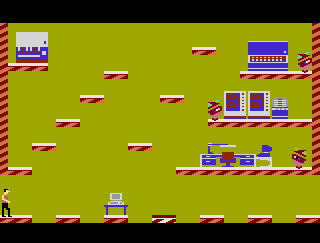

However, this will fail to land you on the Lift in the center of the room.  That said, I always recommend saving this room for much, much later on.  This room is best tackled with at least one or 2 SNOOZES and possibly a LIFT INIT.  If you're not ready, pass on through and come back to it later.  And, if you can avoid this room by going around it, that is also a good strategy.  That said, this room has 7 pieces of furniture in it, making it a high likelihood that there is a puzzle piece within.

--------------

### How to get to the upper-left piece of furniture

First, let's talk about how NOT to get there,  You may be surprised to learn that after you have taken the Lift to the top, you CAN jump to the left and land on one of two platforms, depending on where you jump from.  Here are 2 examples of it:

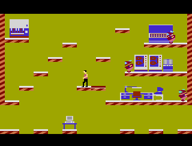
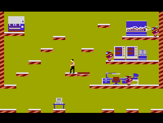

Unfortuantely, this is a trap!  If you end up on the leftmost side, it's impossible to get back; there is no way to "climb the stairs" to get to the top; all you can really do is walk/fall left or jump back to the right which at best will cost you a LIFT INIT, and at worst will cause you to fall down a hole and die.  The moral of the story is: don't try this, it doesn't do you any good.

Instead, the best approach is to jump to the right where the robot is guarding 3 pieces of furniture, and then jump left 3 times to each platform until you get to the upper-left of the screen.  Is it easy?  No.  But, there are some tricks:

**Trick number one:** Don't search any furniture until you have cleared the upper-left piece.  Why?  Well, we can use the existing furniture as helpful markers so we can line up our jumps.

There are 2 places you can successfully jump to the left:

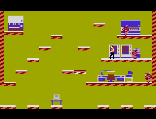
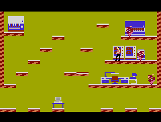

Look carefully at the above GIFS.  The best way to make this jump successfully is to align yourself next to the leftmost furniture before jumping.  If you can line up your left edge with the leftmost edge of the furniture, or even be just a little to the right, you'll make the jump.

That gets you past step one.  Note that if you're just a little bitt off, you'll miss the jump (see below).

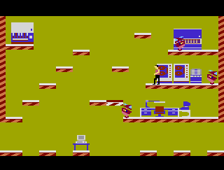

If this happens to you, you can jump back and try again.  The bad news is that if you needed to use a SNOOZES on the robots in order to make the jump, you have precious seconds to try again, and under a lot more stress.  So, you want to be careful and make sure you are lined up next to the furniture properly before making that jump.  Keeping the furniture there for later definitely helps!

From there, you can simply just jump twice and make it to the furniture in the top left:

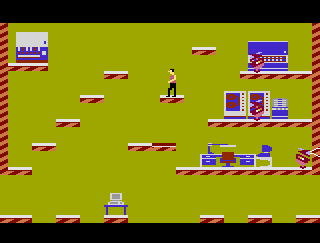

That said, be careful and make sure that you're on the center of the platform!  However, if you are just a little bit off, you'll overshoot. But, you can always recover by jumping back.

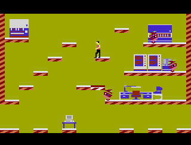

--------------

### How to get to the upper-right piece of furniture

This one is also very hard.  The hardest part is that depending on the robot on the top, you may have to use a SNOOZES, and then navigate some tricky jumps, possibly running out of time.  And, when you get there, you still need to check the piece of furniture!

Let's start with the "unlikely" method.  You may think that it's possible to continue back from the top-left furniture and jump on the highest ledge to get there.  And, it may look impossible:

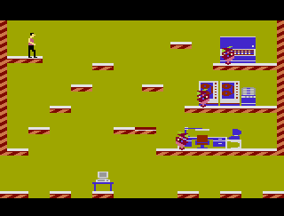

But, it's actually NOT impossible to accomplish this.  You just need a running start and pixel-perfect accuracy:

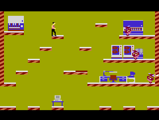

If you do manage to take this approach, it's time to EXERCISE CAUTION.  You can safely walk / fall to the right to search the furniture.  However, if you choose to jump, you will unlock an unexpected bug that will likely cause your demise.  Here it is, captured in gif form from both directions:

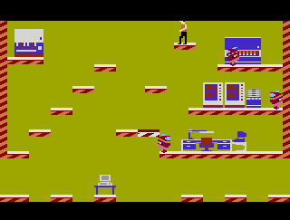
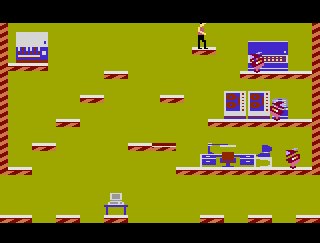

Due to the fact that a) there's a bug, b) you need a pixel-perfect jump to get here anyway, and c) you likely have burned any time left on your SNOOZES by now if you have searched the left-most piece of furniture, I highly discourage getting to the top-right furniture this way.

Note that you can also reach this ledge from the rightmost side (assuming you have already gotten there):

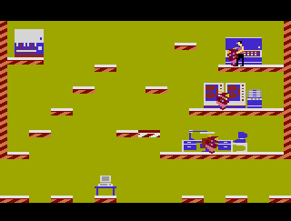

Instead, a better method is proposed.  Jump from a different ledge.  Unfortunately, this also requires a nearly pixel-perfect run-and-press-jump-while-in-air maneuver.  But, it can be done.  It's not pixel-perfect, but it's very close; below are two slightly different GIFs showing successful jumps.

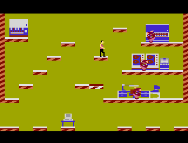
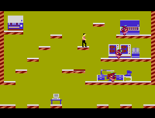

Standing jumps will not work:

Only running starts will get you what you need.

If you do manage to make it up there, you likely only have precious seconds left to search the furniture and avoid the robot.  Be careful!  You don't want to have to waste more SNOOZES.

-----------------

### What to do after you have searched the top-left and top-right pieces of furniture

After the complicated furniture has been searched, try to get the furniture in the middle-right section of the screen.  Again, you may need SNOOZES for this to work.  If you make too many mistakes, this room can be VERY costly on SNOOZES and LIFT INITS.  This is why many consider this the most difficult room in the game.

### Final thoughts

For this particular room-- perhaps it is best to finish it last.  If you already have 36 puzzle pieces, you can skip it; and if, you only need a piece or two, you may luck out and not need to search everything.  Be smart about planning, and you can do it!

-----------------
