Don't accidentally dial twice!  

| &nbsp; | &nbsp; |
:-------:|:-------:
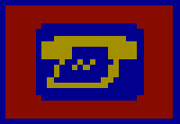 | 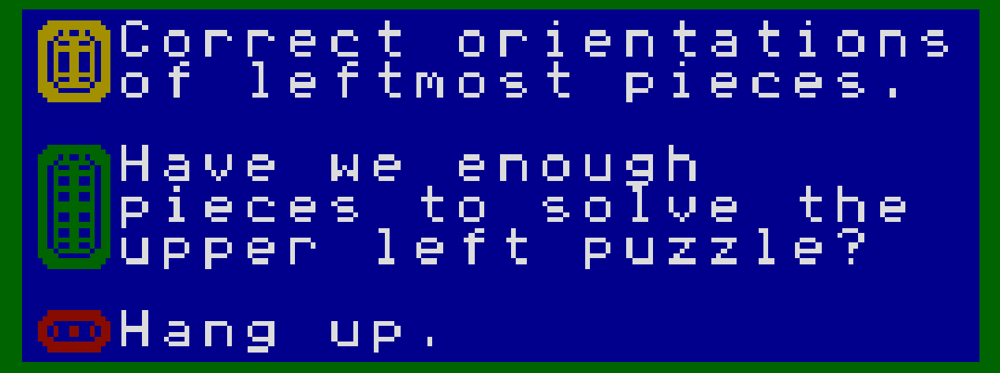

| &nbsp; | &nbsp; |
:-------:|:-------:
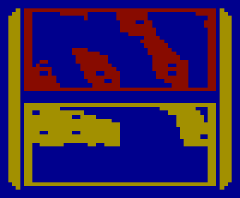 | 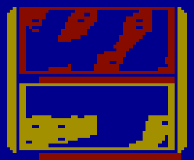

(TBD: Talk about how there's a red mark next to flipped pieces)

| &nbsp; | &nbsp; |
:-------:|:-------:
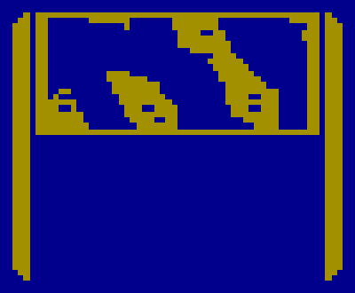 | 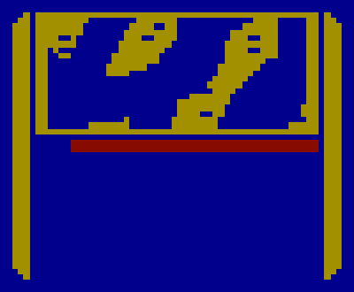

| &nbsp; | &nbsp; |
:-------:|:-------:
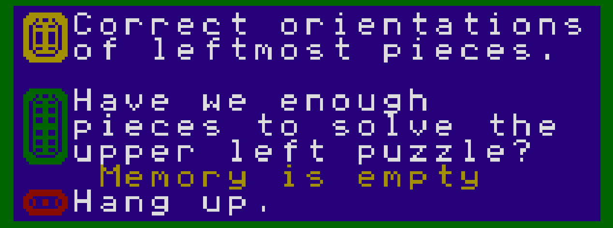 | 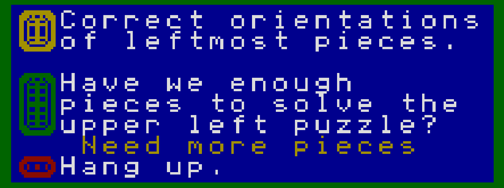
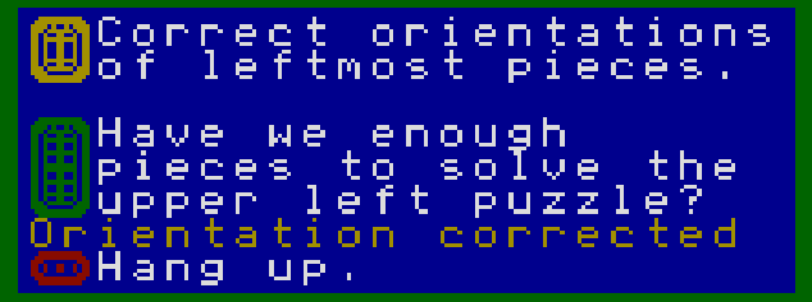 | 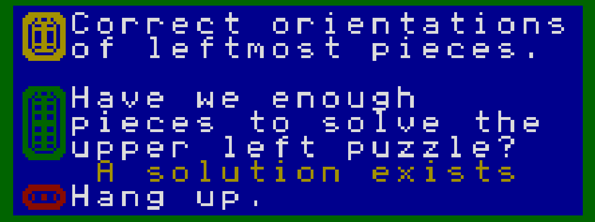
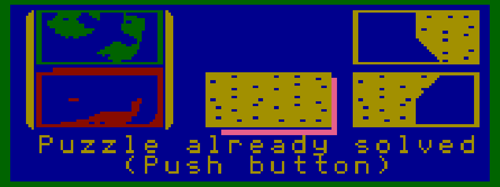 | &nbsp;
------------

Next: [The End](./ending.md) of the game (SPOILERS!!!)

------------

[Back to the main page](../README.md)

