# Atari 7800 Impossible Mission - Walkthrough Guide

**DISCLAIMER:** *All screenshots, etc... are the property of Atari.  Copyright (c) 1989, Atari Corporation.  All rights reserved.*

## Where do I get puzzle pieces?

The Instruction Manual says that whenever searching furniture, you may encounter 3 items, but it provides no pictures as a reference.

| Searching | Nothing Here | Snoozes | Lift Init | Puzzle Piece | 
:----------:|:------------:|:-------:|:---------:|:-------------:
 |  |  |  | 

You may wonder why the "Scissors cutting paper" icon is used to indicate puzzle pieces.  Well, the end result of putting 4 puzzle pieces together is a punchcard.  The icon is supposed to indicate that a punchcard has been cut into pieces.

Here's what a solved Puzzle (completed punch card) made up of 4 different puzzle pieces looks like:

INSERT HERE

## How to Solve Puzzles

While playing the game, you will encounter a large amount of puzzle pieces.  What do they look like?

Here are some examples:

| &nbsp; | &nbsp; | &nbsp; | &nbsp; |
:-----------------------------:|:-------------------------------:|:-----------------------------:|:-------------------------------:
 |  |  | 

The next begged question would be... "what is the end result supposed to look like?"  Below are some examples of finished Puzzles:

| &nbsp; | &nbsp; | &nbsp; |
:----------:|:------------:|:-------------:
 | 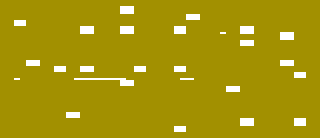 | 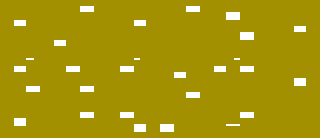 
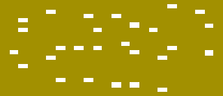 | 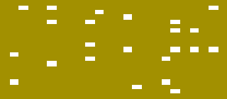 | 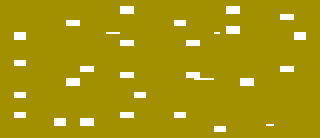 
 | 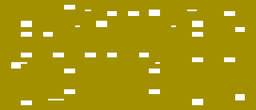 | 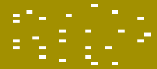

NOTE: Colors used to mean something in the C64; they would indicate the color room that you came out of.  In this game, it's random.

### Molds

### Pieces colored according to the room color?

### What do puzzle pieces look like

| Unoriented | Oriented / one color | Molded | Complete |
:-----------------------------:|:-------------------------------:|:-----------------------------:|:-------------------------------:
 | 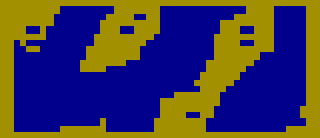 | TBD | TBD
 | 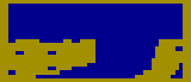 | TBD | TBD
 | 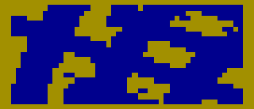 | TBD | TBD
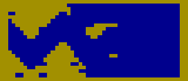 | 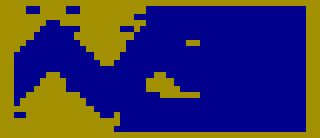 | TBD | TBD
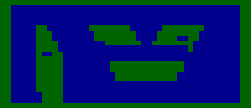 | 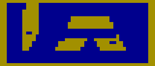 | TBD | TBD
 | 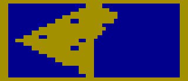 | TBD | TBD
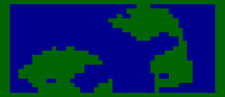 |  | TBD | TBD
 |  | TBD | TBD
 | 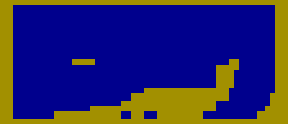 | TBD | TBD
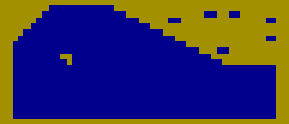 | 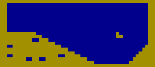 | TBD | TBD
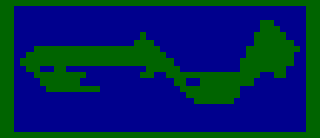 | 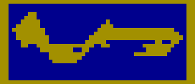 | TBD | TBD
 | 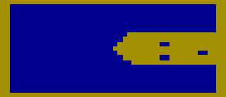 | TBD | TBD
 | 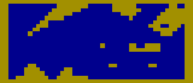 | TBD | TBD
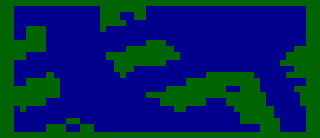 | 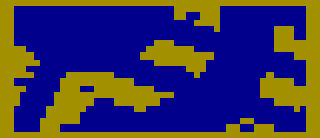 | TBD | TBD
 | 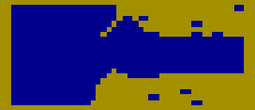 | TBD | TBD
 | 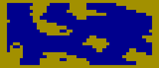 | TBD | TBD
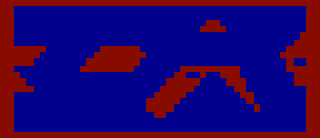 | 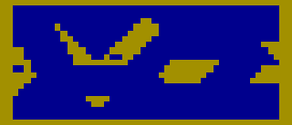 | TBD | TBD
 | 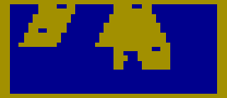 | TBD | TBD
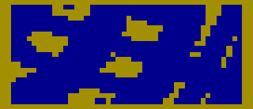 | 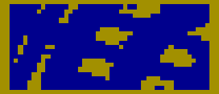 | TBD | TBD
 |  | TBD | TBD
 | 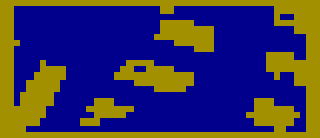 | TBD | TBD
 |  | TBD | TBD
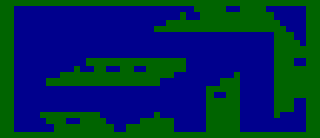 | 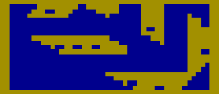 | TBD | TBD
 | 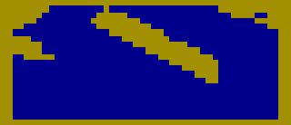 | TBD | TBD
 | 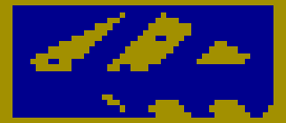 | TBD | TBD
 |  | TBD | TBD
 | 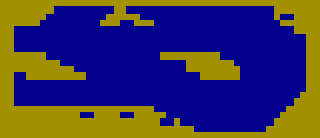 | TBD | TBD
 |  | TBD | TBD
 | 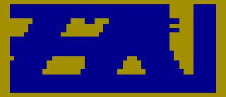 | TBD | TBD
 | 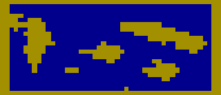 | TBD | TBD
 | 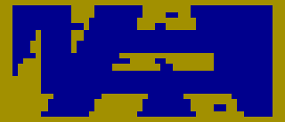 | TBD | TBD
 |  | TBD | TBD
 | 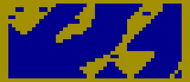 | TBD | TBD
 |  | TBD | TBD
 | 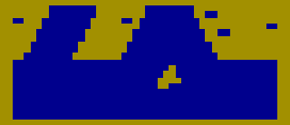 | TBD | TBD
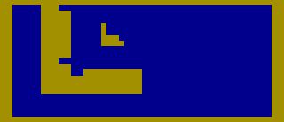 | 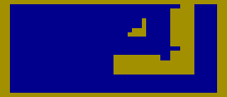 | TBD | TBD

------------

