# Atari 7800 Impossible Mission - Walkthrough Guide

**DISCLAIMER:** *All screenshots, etc... are the property of Atari.  Copyright (c) 1989, Atari Corporation.  All rights reserved.*

## Where do I get puzzle pieces?

The Instruction Manual says that whenever searching furniture, you may encounter 3 types of items, yet the manual itself provides no pictures as references.  Below is a table showing what you may see on-screen when pressing the "up" botton next to furniture in the game:

| Searching | Nothing Here | Snoozes | Lift Init | Puzzle Piece | 
:----------:|:------------:|:-------:|:---------:|:-------------:
 |  | 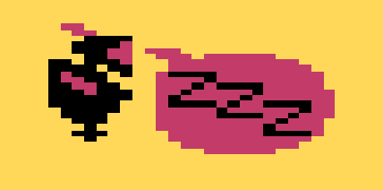 | 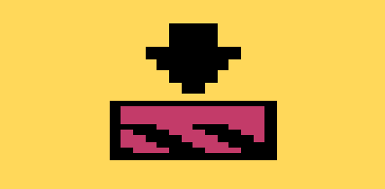 | 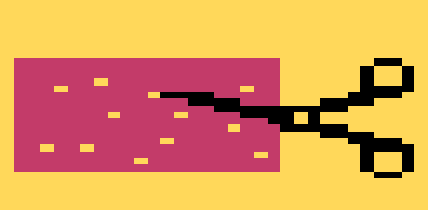

You may wonder why the "Scissors cutting paper" icon is used to indicate puzzle pieces.  Well, the end result of putting 4 puzzle pieces together is a punchcard.  What is a punchcard?  Younger players may not realize that in the early days of computing, paper cards with holes in them were used to program machines.  Whole programs would be written on stacks of cards with these holes punched out.  Here is an example of what they look like (from wikipedia):

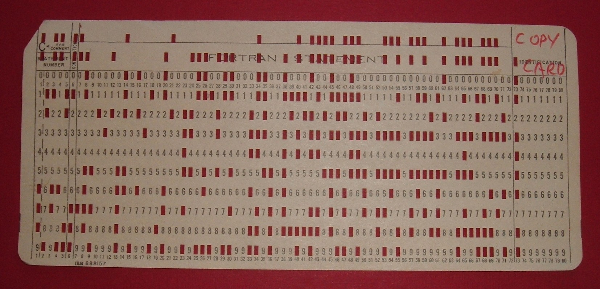
(The above image came from [Wikipedia](https://upload.wikimedia.org/wikipedia/commons/d/d8/IBM1130CopyCard.agr.jpg))

In the game itself, a completed punch card looks like the this:
 
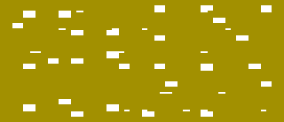

In the game, Elvin Atombender took 9 punchcards that when combined created a 9-digit passcode and cut each of them up into four pieces.  That's why there is a scissors on the icon; it indicates that this is part of a punchcard that has been cut up.

## How to Solve Puzzles

While playing the game, you will encounter a large amount of puzzle pieces.  What do they look like?

Here are some examples:

| &nbsp; | &nbsp; | &nbsp; | &nbsp; |
:-----------------------------:|:-------------------------------:|:-----------------------------:|:-------------------------------:
 | 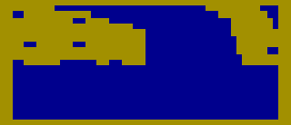 | 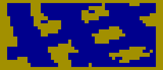 | 

On the Atari 7800 version of Impossible Mission, puzzle pieces only come in 3 colors: Red, Yellow, and Green.  In other versions of the game, the color of the puzzle piece is supposed to indicate what color room the puzzle piece was found in.  However, in the Atari 7800 version, the same room will yield any color of piece; it is all random and not tied to the room colors.

So, how to we get from Puzzle Pieces to finished Punchcards?  Molds!

### Molds

| &nbsp; | **1** | **2** | **3** | **4**
:-------:|:-----------:|:-----------:|:-----------:|:------------:
**A** |  |  |  | 
**B** |  |  |  | 
**C** |  |  |  | 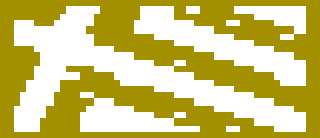 
**D** |  |  |  | 

There are 16 "molds" in the game.  Think of them like Cookie Cutters.  When Elvin cut up his punchcards, he did so in a way that makes it easier to solve them.  Each initial cut wwas done with a unuqie cookie cutter / mold to divide it into two pieces.  Then, each half was cut a second time with another different cookie cutter / mold.  This may seem like a lot of information, but the important point is that it creates something you can work from.  Each puzzle piece in the game can be paired with another to make a design that corresponds to one of these molds.  These 9 molds will be unique; they won't repeat.  But, since molds are reused for secondary cuts, this does cause some trickiness:

 * First, the color of the punchcard doesn't matter.  I always make my puzzle pieces yellow so that I can see them better, and they always generate working punchcards when assembled correctly.
 * It is possible that you can line up 2 pieces and make something that matches a mold / cookie cutter layout, but have that be an incorrect pairing.  Sometimes two secondary cuts use the same mold and line up perfectly.  You will know that this has occurred when you can't find the other two pieces that make the other half of the mold.
 * There are situations where you may create a full punchcard, but it's incorect. Each punchcard is made up of 4 specific, known pieces.  Let's say of the 36 pieces, the game knows that piece 4, 7, 22, and 29 are needed for a solution.  If, somehow you cobble together a punch-card that uses the wrong four pieces, the game will not count it as complete no matter how you reorient it.  This is a very rare situation that can occur.
 * Unline the above problem, there are pieces that can be reflected and inserted into a puzzle two ways.  Only one way is correct.  See below for an example:

This means there are a lot of things that can go wrong.  However, a lot of things can go very right, now that you know the secret of trying to replicate mold patterns and then try to find their matching half.

### Solving Puzzles - A Complete Example

| &nbsp; | **Piece A** | **Piece B** | **Piece C** | **Piece D**
:-------:|:-----------:|:-----------:|:-----------:|:------------:
**Found piece** |  |  |  | 
**Reoriented and common color** | 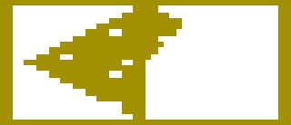 |  |  | 
**Primary Mold (first cut)** |  |   |   |  
**Secondary Mold (second cut)** |  |   |   |  
**Assembling 2 pieces** |  |  |  | 
**Completed** | 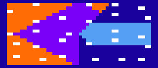 | 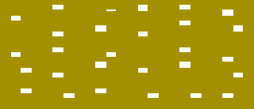 |  | 

----------------------

### All Puzzle Pieces - EXAMPLE 1

| &nbsp; | **Piece A** | **Piece B** | **Piece C** | **Piece D** | **Mold** | **Half 1** | **Half 2** | **Completed**
:-------:|:-----------:|:-----------:|:-----------:|:-----------:|:--------:|:----------:|:----------:|:--------------:
**Puzzle 1** |  |  |  |  |  |  |  | TBD
**Puzzle 2** | 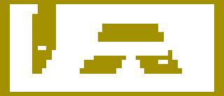 |  | 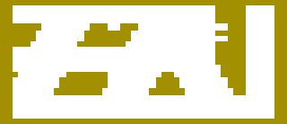 | 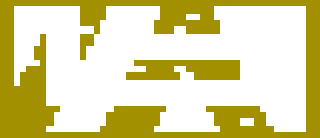 |  | 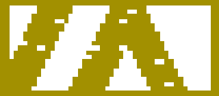 | 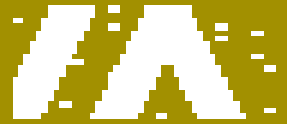 | TBD
**Puzzle 3** |  |  | 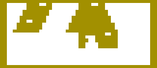 | 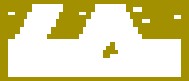 |  |  | 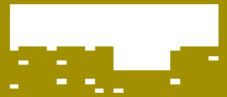 | TBD
**Puzzle 4** |  | 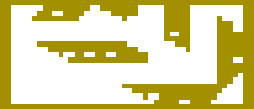 | 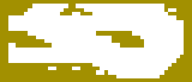 |  |  |  | 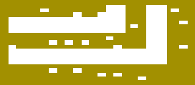 | TBD
**Puzzle 5** |  | 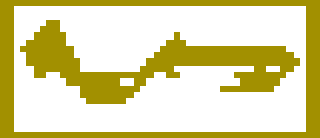 | 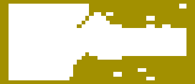 | 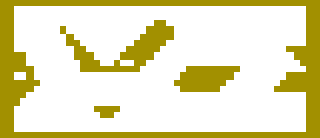 |  |  | 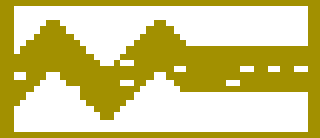 | TBD
**Puzzle 6** | 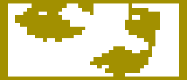 | 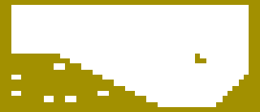 | 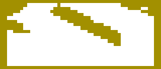 |  |  |  | 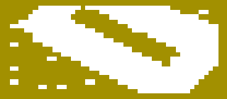 | TBD
**Puzzle 7** | 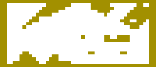 | 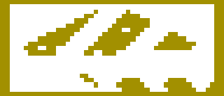 | 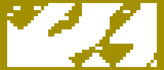 | 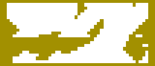 |  | 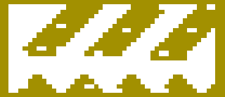 |  | TBD
**Puzzle 8** |  | 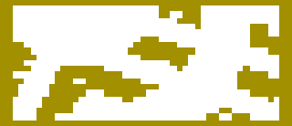 | 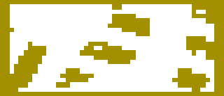 |  |  | 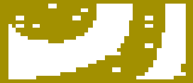 | 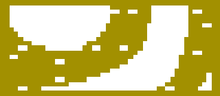 | TBD
**Puzzle 9** | 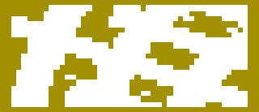 | 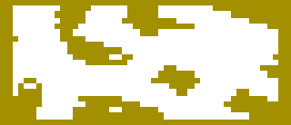 | 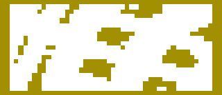 | 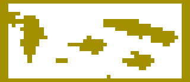 |  | 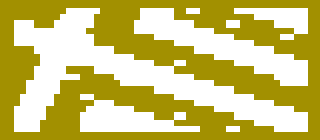 | 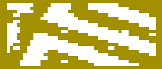 | TBD

### Try it yourself!  The above puzzle corresponds to a Save Game.

-------------------

## Special Thanks

-------------------

