# Atari 7800 Impossible Mission - Walkthrough Guide

**DISCLAIMER:** *All screenshots, etc... are the property of Atari.  Copyright (c) 1989, Atari Corporation.  All rights reserved.*

## How to Solve Puzzles

While playing the game, you will encounter a large amount of puzzle pieces.  What do they look like?

Here are some examples:

:-----------------------------:|:-------------------------------:|:-----------------------------:|:-------------------------------:
 |  |  | 

### Molds

### Pieces colored according to the room color?

### What do puzzle pieces look like

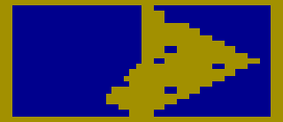

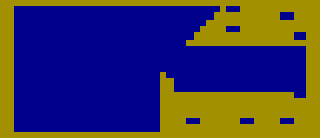

--------------

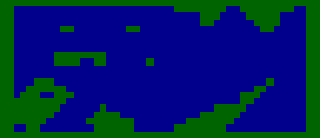
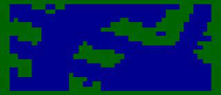

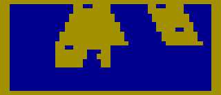

--------------

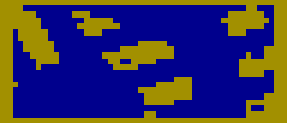
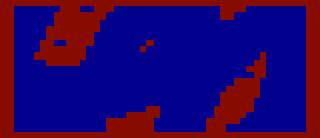

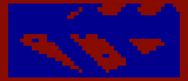

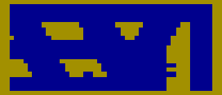
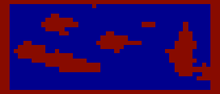

---------------

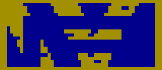

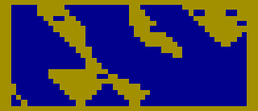

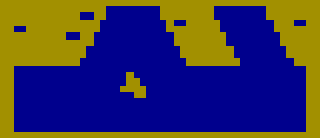

------------

